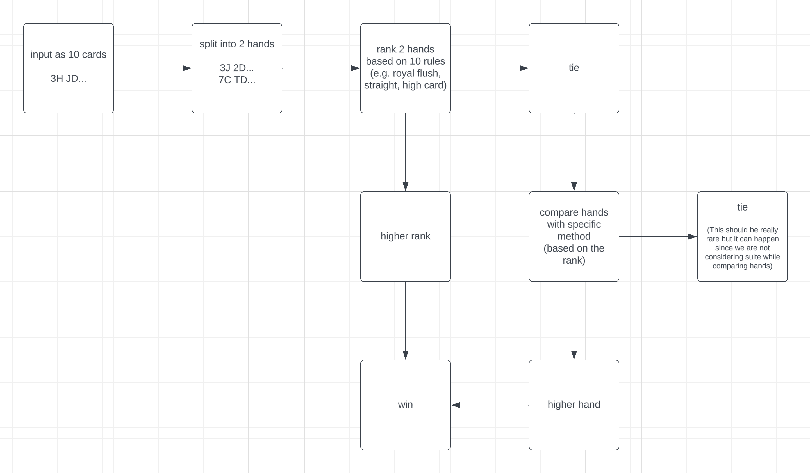

# Explanation

This flowchart represents how app works



<br><br>

# Build, Run and Test

## prerequisites
- JDK version 11+
- Command lines "javac", "jar" and "java"

## Build
```
javac app/App.java
jar cfm my-poker-solution.jar ./manifest.txt app/*
```

## Run
```
cat poker-hands.txt | java -jar my-poker-solution.jar
```

## Unit-testing
```
javac app/App.java
java app.App test
```
